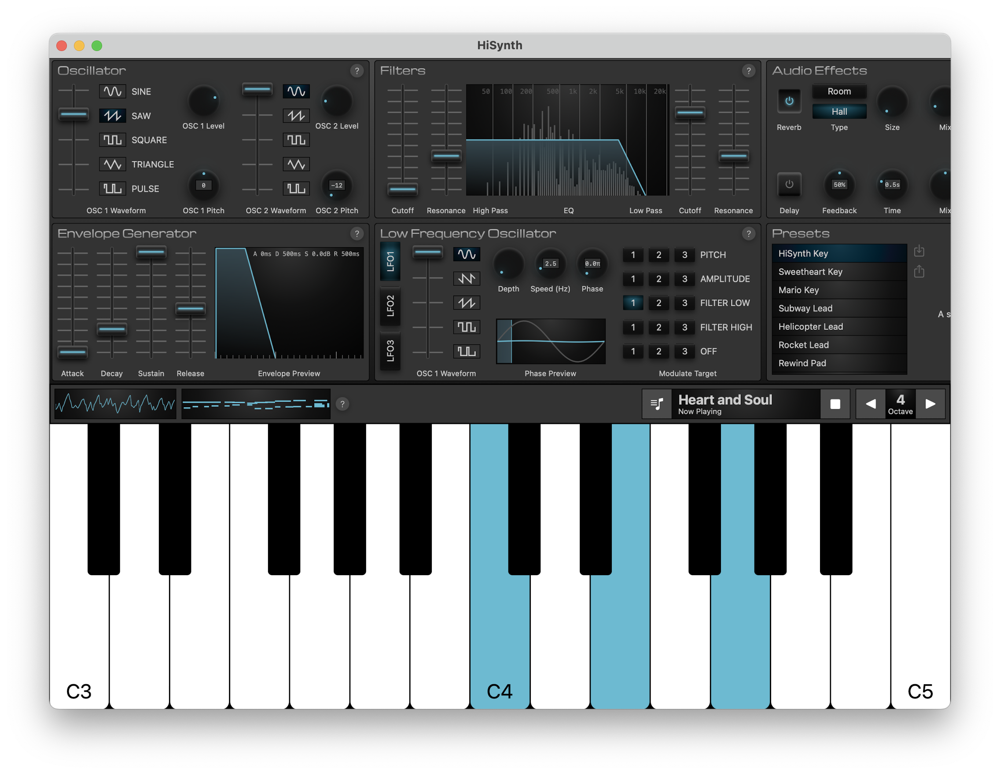
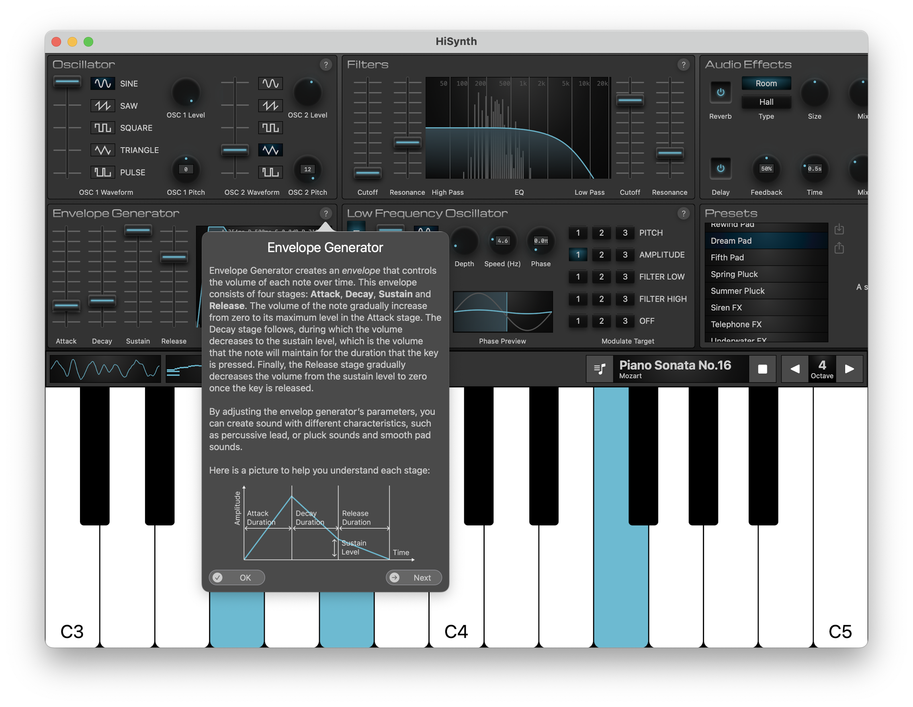
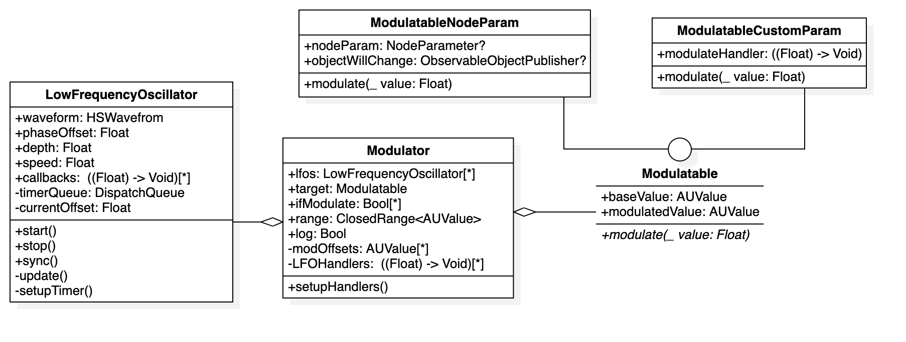

---

HiSynth is a simple yet powerful analog synthesizer built with purely Swift for educational purposes, allowing you to explore the fundamental elements of a synthesizer.

<table>
<tr>
<td>

</td>
<td>

</td>
</tr>
</table>

## Introduction

### Features

- Two Oscillators with 5 waveforms: Sine, Triangle, Sawtooth, Square and Pulse, with separate pitch and level controls.
- Amplitude Envelope Generator with Attack, Decay, Sustain and Release controls.
- Low / High-Pass Filters with real-time frequency spectrum visualization and EQ curves.
- Three LFOs (Low-Frequency Oscillators) that can be used to modulate the pitch, amplitude, and cut-off frequency of the filters, with waveform, depth, speed and phase controls. These LFOs can be used individually or combined by toggling the modulation matrix.
- Four Audio Effects: Delay, Reverb, Distortion and Decimator.
- A Preset Management System that allows you to share and import presets conveniently with a short encoded string.
- A Rack that contains the real-time visualization of the output waveform and a piano roll showing the keyboard note history. It also includes a MIDI music player that allows the synthesizer to playback songs automatically (Only available on macOS).
- Walkthrough tutorial that provides an onboarding experience to guide you through the panels and components of the synthesizer.

### Technologies

- SwiftUI: Used to build most of the user interface.
- SpriteKit: Used to render all the audio visualizations, including waveform, piano roll, ADSR curve, EQ curve and frequency spectrum.
- AVFoundation (AudioKit): Used to develop core audio synthesizing and processing functionalities.

### Play with HiSynth

HiSynth is a Swift App Playground, available on macOS 13.0+, iPadOS 16.0+ and iOS 16.0+ (Needs to be compiled with Xcode on macOS). For macOS, just clone the repository and double-click `HiSynth.swiftpm` if you have Swift Playground App installed or open the project with Xcode. For iPadOS, you can AirDrop the `HiSynth.swiftpm` to your iPad, then compile and run it directly in Swift Playground.

## Development Notes

If you are interested in expanding the project or looking into the development details, here are some notes that might be helpful.

### AudioKit

AudioKit gives a great encapsulation of AVFoundation, CoreAudio and AudioUnit, making connecting audio nodes and developing audio applications much easier. Some extensions of AudioKit, such as [AudioKitEX](https://github.com/AudioKit/AudioKitEX), [SporthAudioKit](https://github.com/AudioKit/SporthAudioKit), [SoundPipeAudioKit](https://github.com/AudioKit/SoundpipeAudioKit) provide more complex DSP with C and deliver higher performance. However, C code can not currently be compiled on the iPad version of Swift Playground. Therefore, in this project, I only used the base [AudioKit](https://github.com/AudioKit/AudioKit) that contains Swift code only and implemented Amplitude Envelope and Low Frequency Oscillators with pure Swift. If these computations were done with C utilizing low-level Core Audio APIs, the resource usage could be significantly reduced.

Possible improvements include using `DyanamicOscillator` and `AmplitudeEnvelope` in the `SoundPipeAudioKit` library instead of my `HSOscillator` and Envelope Generator powered by `DispatchQueue`s. Using `SporthAudioKit`'s Sporth Operations to chain LFO modulations and audio effects could also make the parameter modulation more efficient and flexible.

### Parameter Modulation

To modulate parameters with Swift, I utilized `DispatchQueue` to perform modulation at the sample rate of 50 per second. Given that the frequencies of LFOs range from 0.2Hz to 20Hz per second, this sample rate should be high enough. This diagram roughly shows the parameter modulating process among relevant classes:



Then, during the initialization of the controllers, the modulators connect modulation operations. For instance, here is the code for modulating filter parameters:


```swift
// v is modulation offset at current time, ranging from -1 to 1
let amplitude = ModulatableCustomParam(0.5) { v in
    self.outputNode.volume = (0.5 + v).clamp(to: 0.0...1.0)
}
let amplitudeMod = Modulator(target: amplitude, range: -0.5...0.5, lfos: lfos)
let lowMod = Modulator(target: $lowPassCutoff, range: -1.0...1.0, log: true, lfos: lfos)
let highMod = Modulator(target: $highPassCutoff, range: -1.0...1.0, log: true, lfos: lfos)
```

The `Modulator` class holds the LFOs (shared across the synthesizer so that the LFOs can be configured and synced together) and the modulation target. At each `update()` execution of each `LowFrequencyOscillator`, the LFO looks for the waveform table and calculates the current offset value ranging from -1 to 1. The offset will be called to all the `callbacks` in LFO's callback array. `Modulator` will set up the callbacks that take an offset value and apply it to the target parameter. The offset for each LFO is temporarily stored in the `modOffsets` array, the modulator will sum the offsets to apply the combined offset to the parameter.

The `Modulator` class uses the `range` parameter to scale the offset value to the desired range. The `log` parameter specifies whether the offset value should be scaled with a logarithmic function. This is useful for modulating the frequencies of filters.

Following the convention, when each key hits, all LFOs are synced to the phase position.

### Preset Management

The preset management system is a zlib compressed, base64 encoded string of the parameter values stored in the memory layout of the controllers. The encoding and decoding helper protocol is `ParameterManagable`. `ParameterManagable` saves a copy of the parameter values from the controller, such as `OscillatorController`, `LFOConteroller` etc. They use a dictionary `dataMap` as the intermediate representation of parameter values. The protocol provides these utility functions:

- `dump() -> String`: Uses `Mirror` to extract the byte data of each parameter and store them in `Data`. The `Data` is then compressed with zlib and encoded with base64. The decoding process is the reverse of the encoding process.
- `parse(_ presetStr: String)`: Parse an encoded string and load the parameter values into the `dataMap`, then `inject` the `dataMap` into the parameter manager.
- `inject(from values: [String: Any])`: Load the parameter values from the `dataMap` into the parameter manager (requires implementation).
- `extract(controller: Controller)`: Extract the parameter values from the controller and store them in the parameter manager (requires implementation).
- `apply(controller: Controller)`: Apply the parameter values from the parameter manager to the controller (requires implementation).


A valid preset string can be separated into six parts with a `:` delimiter. Each part is the encoded string using the method above. The first substring represents the preset name, and the reset five substrings represent the parameter values of the five controllers.

You can find all the factory preset strings and (possibly) other community presets in the [presets.md](./presets.md) file.

## Misc

### Links

- [Figma File](https://www.figma.com/file/gpXr3W1JtFPUJjRsIMk7CP/HiSynthDesign): Design prototype of HiSynth.
- [AudioKit CookBook](https://github.com/AudioKit/Cookbook): I learned a lot about audio signal processing with Swift by reading through the repository.
- [Moog Subsequent Manual](https://api.moogmusic.com/sites/default/files/2017-09/Subsequent_37_Manual_0.pdf): I referenced the audio graph in the manual when developing HiSynth.
- [Yamaha Reface Owner's Manual](https://aadl.org/files/catalog_guides/1508075_reface_manual.pdf): This manual is also a great resource for learning more about synthesizers. Yamaha

### Swift Student Challenge 2023

This project is submitted to WWDC Student Challenge 2023 and has been accepted with a WWDC Scholarship.

The open-sourced version of HiSynth is slightly different from the submitted version in terms of Swift Packages. Due to the submission requirements stating that the entire judging process is offline, I downloaded the necessary open-source libraries (AudioKit, Keyboard and Tonic) and put the source code and corresponding LICENSE files into the submitted swift package. Doing so eliminates the need for an internet connection during the judging process. For the open-sourced version, I added those package dependencies and updated `import` statements for most of the code.